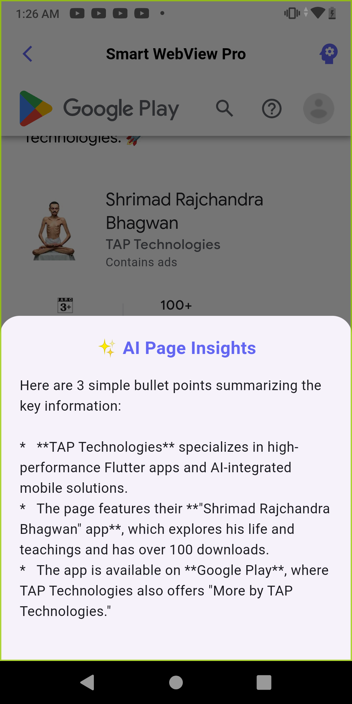
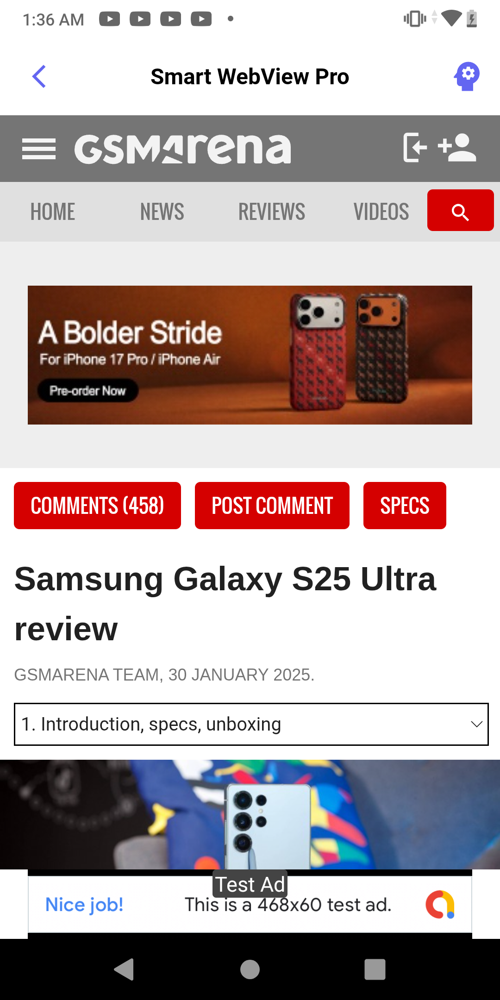
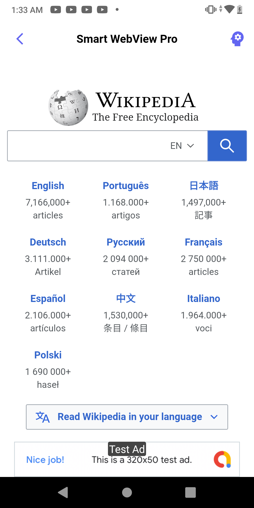
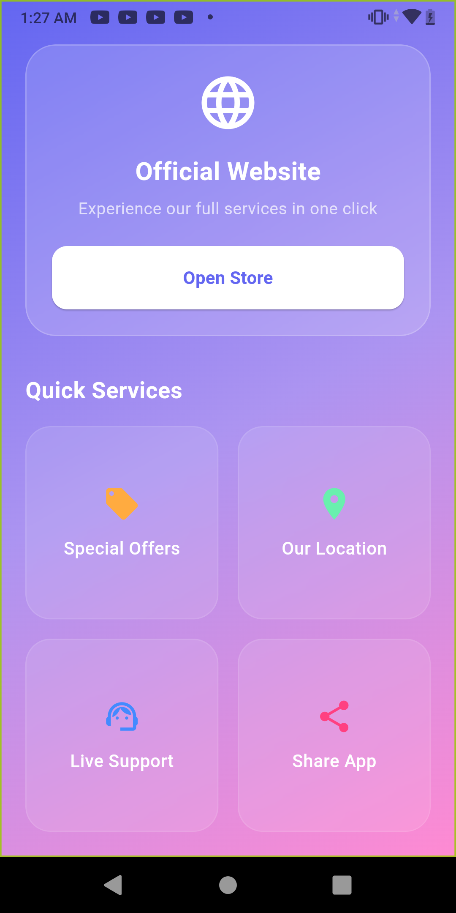
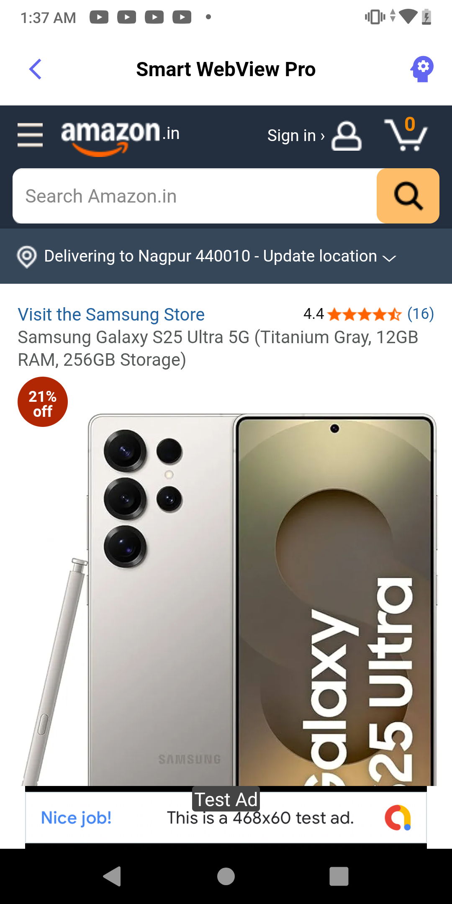

# 🚀 Premium AI-Powered WebView Engine (Pro)

  
  
  

---

### 🌟 Overview
**AI-WebView-Gemini-Pro** is a high-performance, production-ready Flutter WebView engine developed by **Tap Technologies**. It goes beyond standard browsing by integrating **Google Gemini AI** directly into the web experience, allowing users to interact, summarize, and analyze web content in real-time.

---

### 📱 App Showcase
Explore the premium interface and AI capabilities of the engine.

<table border="0">
 <tr>
    <td align="center">
      <b>Premium Dashboard</b> 
      
    </td>
    <td align="center">
      <b>AI Insights</b> 
      
    </td>
    <td align="center">
      <b>Smart Browsing</b> 
      
    </td>
 </tr>
</table>

 

  
  

---

### ✨ Key Features
- **🤖 Smart AI Integration:** Built-in Gemini AI for real-time web content analysis.
- **💎 Glassmorphism UI:** Modern, sleek, and premium user interface.
- **⚡ High Performance:** Optimized for low latency and smooth scrolling.
- **🔒 Secure Browsing:** Advanced security layers for safe data handling.
- **📱 Multi-Platform:** Seamlessly runs on Android and iOS.

---

### 🛠️ Tech Stack
- **Framework:** [Flutter](https://flutter.dev)
- **Language:** [Dart](https://dart.dev)
- **AI Model:** Google Gemini API
- **UI Design:** Glassmorphism Material 3

---

### 📦 Commercial License & Source Code
> **Note:** This repository is for **Portfolio Showcase** only. The full commercial source code, including the backend integration and AI logic, is available for purchase.

**Why choose this engine?**
- Pre-configured AdMob integration.
- Clean, well-documented code.
- Ready for Play Store/App Store deployment.

---

### 📞 Contact for Business Inquiries
Interested in buying this template or a custom build? Let's connect:

- **Founder:** Tap Technologies
- **LinkedIn:** [Tap Technologies Official](https://www.linkedin.com/company/tap1technologies)
- **Play Store:** [Official Portfolio](https://bit.ly/tapTechnologies)
- **Email:** [tanishkatechnosolutions@gmail.com](mailto:tanishkatechnosolutions@gmail.com)

---

  *"Building the future of mobile solutions, one tap at a time."*  
  <b>© 2026 Tap Technologies</b>

